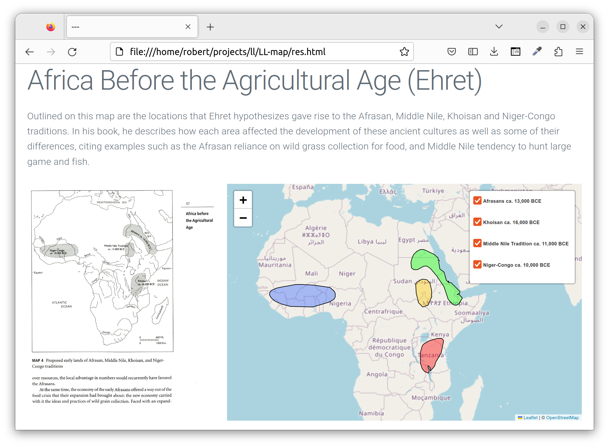
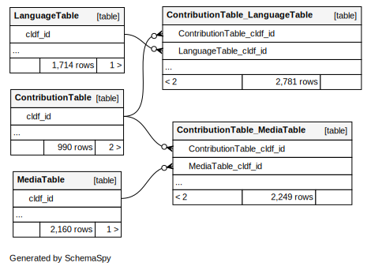

# Using the LL-MAP CLDF dataset

## It's just CLDF

Thus, you can do whatever can be done with CLDF, see https://github.com/cldf/cookbook


## Showing a map

To get a quick overview of the information contained in a LL-MAP contribution, the `llmap.show`
command can be used:

```shell
$ cldfbench llmap.show 323315
```

Passing in a contribution ID it will create an HTML document, containing map images using the
[data URI scheme](https://en.wikipedia.org/wiki/Data_URI_scheme) and GeoJSON objects rendered
using the [leaflet javascript library](https://leafletjs.com/).




## Using CLDF SQL

The SQLite database which can be created from the dataset running
```shell
cldf createdb cldf multitree.sqlite
```
has the following schema (see [cldf/README](cldf/README.md) for a description of individual columns):


